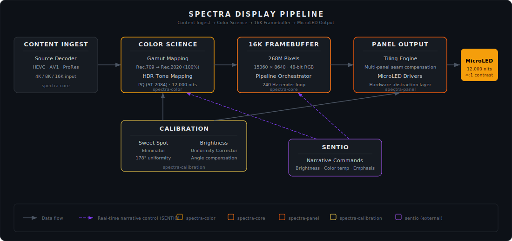

<div align="center">


### The Living Canvas

**16K MicroLED Display Engine**

<br/>

[](https://github.com/sylvain-cinema/spectra/actions/workflows/ci.yml)
[](LICENSE)
[](https://www.rust-lang.org)
[](https://python.org)
[](https://sylvain-cinema.github.io)

<br/>

*A morphable 16K self-emissive MicroLED display that eliminates the cinema sweet spot problem.*
*Consistent brightness and color fidelity across a near-180° viewing cone.*

<br/>

**Every Seat is the Best Seat.**

</div>

<br/>

---

<br/>

## Overview

SPECTRA is Sylvain's proprietary display engine — a self-emissive MicroLED system that fundamentally solves the viewing angle problem plaguing cinema for over a century. Unlike projection-based systems (IMAX, Dolby Cinema) where only 15–20% of seats offer optimal viewing, SPECTRA delivers reference-quality imagery to **every seat in the auditorium**.

<br/>

## Key Specifications

<table>
<tr><td><strong>Resolution</strong></td><td>16K × 16K (268 million pixels)</td></tr>
<tr><td><strong>Peak Brightness</strong></td><td>12,000 nits (4× brighter than Dolby Vision)</td></tr>
<tr><td><strong>Contrast Ratio</strong></td><td>∞ : 1 (true black, pixel-level control)</td></tr>
<tr><td><strong>Viewing Angle</strong></td><td>178° uniform luminance</td></tr>
<tr><td><strong>Color Gamut</strong></td><td>100% Rec.2020 coverage</td></tr>
<tr><td><strong>HDR Format</strong></td><td>PQ (SMPTE ST 2084) / HLG</td></tr>
<tr><td><strong>Refresh Rate</strong></td><td>240 Hz native</td></tr>
<tr><td><strong>Pixel Pitch</strong></td><td>Sub-millimeter (venue-dependent)</td></tr>
<tr><td><strong>Panel Lifetime</strong></td><td>100,000+ hours</td></tr>
</table>

<br/>

## Architecture

<div align="center">



</div>

<br/>

## Workspace Crates

| Crate | Description |
|:------|:------------|
| **`spectra-core`** | Rendering pipeline orchestrator · 16K framebuffer management |
| **`spectra-color`** | Rec.2020+ color gamut mapping · PQ/HLG HDR tone mapping · Per-panel calibration |
| **`spectra-panel`** | MicroLED hardware abstraction · Multi-panel tiling engine · Thermal management |
| **`spectra-calibration`** | Sweet spot elimination algorithms · Brightness uniformity · Viewing angle compensation |

<br/>

## Quick Start

```bash
# Build all crates
cargo build --workspace

# Run tests
cargo test --workspace

# Python bindings
cd python && pip install -e .
```

```rust
use spectra_core::{DisplayPipeline, DisplayConfig, Resolution};
use spectra_color::gamut::ColorSpace;

let config = DisplayConfig::builder()
    .resolution(Resolution::UHD_16K)
    .color_space(ColorSpace::Rec2020)
    .hdr_mode(HdrMode::PQ)
    .peak_brightness(12_000.0)
    .build();

let pipeline = DisplayPipeline::new(config)?;
pipeline.start()?;
```

<br/>

## Sylvain Ecosystem

| Repository | Description | |
|:-----------|:------------|:--|
| **spectra** | 16K MicroLED Display Engine | *this repo* |
| [**sonora**](https://github.com/sylvain-cinema/sonora) | Wave Field Synthesis Audio Engine | |
| [**sentio**](https://github.com/sylvain-cinema/sentio) | Empathic AI Narrative Intelligence | |
| [**stratum**](https://github.com/sylvain-cinema/stratum) | Volumetric Display System | |
| [**sylvain-sdk**](https://github.com/sylvain-cinema/sylvain-sdk) | Unified Developer SDK | |
| [**sylvain-core**](https://github.com/sylvain-cinema/sylvain-core) | Platform Core Services | |
| [**sylvain-cloud**](https://github.com/sylvain-cinema/sylvain-cloud) | Cloud Infrastructure | |
| [**content-pipeline**](https://github.com/sylvain-cinema/content-pipeline) | Content Mastering Pipeline | |
| [**research**](https://github.com/sylvain-cinema/research) | Technical Papers & Specs | |
| [**docs**](https://github.com/sylvain-cinema/sylvain.github.io) | Developer Documentation | |

<br/>

## License

Licensed under the [Apache License, Version 2.0](LICENSE).

<br/>

---

<div align="center">
<br/>


<sub>Every Seat is the Best Seat</sub>

</div>
