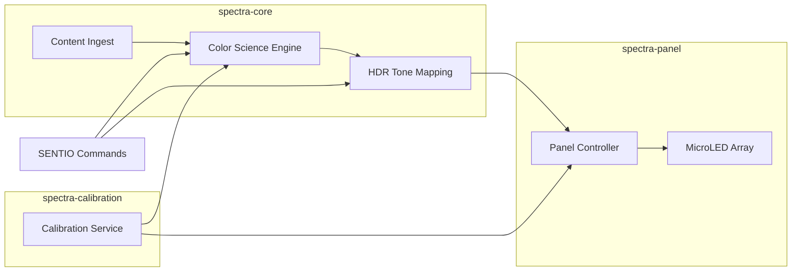

<](https://github.com/sylvain-cinema/spectra/actions)
[](LICENSE)
[](https://sylvain-cinema.github.io)

*A morphable 16K MicroLED self-emissive display system that eliminates the cinema sweet spot problem.*

</div>

---

## Overview

SPECTRA is Sylvain's proprietary display engine — a self-emissive MicroLED system delivering consistent brightness and color fidelity across a near-180° viewing cone. Unlike projection-based systems (IMAX, Dolby Cinema) where only 15-20% of seats offer optimal viewing, SPECTRA ensures **every seat is the best seat**.

### Key Specifications

| Parameter | Value |
|-----------|-------|
| Resolution | 16K × 16K (262,144 × 262,144 subpixels) |
| Peak Brightness | 10,000+ nits |
| Contrast Ratio | 1,000,000:1 (true black) |
| Viewing Angle | 178° (uniform luminance) |
| Color Gamut | Rec.2020+ (99.8% coverage) |
| Refresh Rate | 120Hz native, 240Hz interpolated |
| Pixel Pitch | Sub-millimeter (venue-dependent) |
| Panel Lifetime | 100,000+ hours |

## Architecture



## Modules

| Crate | Description |
|-------|-------------|
| `spectra-core` | Rendering pipeline orchestrator and 16K framebuffer management |
| `spectra-color` | Rec.2020+ color gamut mapping, HDR PQ/HLG tone mapping |
| `spectra-panel` | MicroLED hardware abstraction, multi-panel tiling, thermal management |
| `spectra-calibration` | Sweet spot elimination, brightness uniformity, viewing angle compensation |

## Building

```bash
# Build all crates
cargo build --workspace

# Run tests
cargo test --workspace

# Build Python bindings
cd python && pip install -e .
```

## Quick Start

```rust
use spectra_core::{DisplayPipeline, DisplayConfig, Resolution};
use spectra_color::gamut::ColorSpace;

let config = DisplayConfig::builder()
    .resolution(Resolution::UHD_16K)
    .color_space(ColorSpace::Rec2020)
    .hdr_mode(HdrMode::PQ)
    .peak_brightness(10_000.0)
    .build();

let pipeline = DisplayPipeline::new(config)?;
pipeline.start()?;
```

## Sylvain Ecosystem

SPECTRA is part of the Sylvain cinema technology platform:

| Repository | Description |
|-----------|-------------|
| **spectra** (this repo) | 16K MicroLED Display Engine |
| [sonora](https://github.com/sylvain-cinema/sonora) | Wave Field Synthesis Audio Engine |
| [sentio](https://github.com/sylvain-cinema/sentio) | Empathic AI Narrative Intelligence |
| [stratum](https://github.com/sylvain-cinema/stratum) | Volumetric Display System |
| [sylvain-sdk](https://github.com/sylvain-cinema/sylvain-sdk) | Unified Developer SDK |
| [sylvain-core](https://github.com/sylvain-cinema/sylvain-core) | Platform Core Services |
| [sylvain-cloud](https://github.com/sylvain-cinema/sylvain-cloud) | Cloud Infrastructure |
| [content-pipeline](https://github.com/sylvain-cinema/content-pipeline) | Content Mastering Pipeline |
| [venue-control](https://github.com/sylvain-cinema/venue-control) | Venue Control System |
| [research](https://github.com/sylvain-cinema/research) | Technical Papers & Specs |

## License

Licensed under the Apache License, Version 2.0. See [LICENSE](LICENSE) for details.

## Contributing

See [CONTRIBUTING.md](CONTRIBUTING.md) for guidelines.

---

<div align="center">
<strong>SYLVAIN</strong> — The Future of Cinematic Storytelling<br>
<sub>Every Seat is the Best Seat</sub>
</div>
]]>