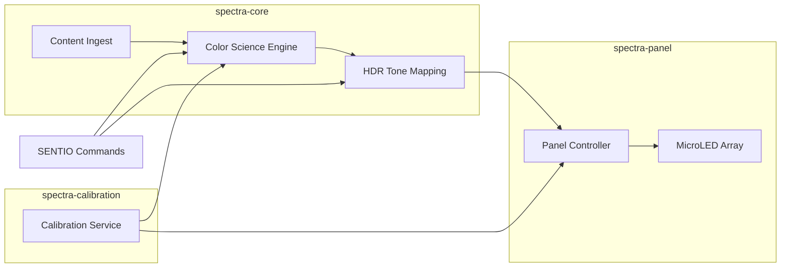

<div align="center">


### The Living Canvas

**16K MicroLED Display Engine**

<br/>

[](https://github.com/sylvain-cinema/spectra/actions/workflows/ci.yml)
[](LICENSE)
[](https://www.rust-lang.org)
[](https://python.org)
[](https://sylvain-cinema.github.io)

<br/>

*A morphable 16K self-emissive MicroLED display that eliminates the cinema sweet spot problem.*
*Consistent brightness and color fidelity across a near-180° viewing cone.*

<br/>

**Every Seat is the Best Seat.**

</div>

<br/>

---

<br/>

## Overview

SPECTRA is Sylvain's proprietary display engine — a self-emissive MicroLED system that fundamentally solves the viewing angle problem plaguing cinema for over a century. Unlike projection-based systems (IMAX, Dolby Cinema) where only 15–20% of seats offer optimal viewing, SPECTRA delivers reference-quality imagery to **every seat in the auditorium**.

<br/>

## Key Specifications

<table>
<tr><td><strong>Resolution</strong></td><td>16K × 16K (262,144 × 262,144 subpixels)</td></tr>
<tr><td><strong>Peak Brightness</strong></td><td>10,000+ nits</td></tr>
<tr><td><strong>Contrast Ratio</strong></td><td>1,000,000 : 1 (true black)</td></tr>
<tr><td><strong>Viewing Angle</strong></td><td>178° uniform luminance</td></tr>
<tr><td><strong>Color Gamut</strong></td><td>Rec.2020+ (99.8% coverage)</td></tr>
<tr><td><strong>HDR Format</strong></td><td>PQ (SMPTE ST 2084) / HLG</td></tr>
<tr><td><strong>Refresh Rate</strong></td><td>120 Hz native, 240 Hz interpolated</td></tr>
<tr><td><strong>Pixel Pitch</strong></td><td>Sub-millimeter (venue-dependent)</td></tr>
<tr><td><strong>Panel Lifetime</strong></td><td>100,000+ hours</td></tr>
</table>

<br/>

## Architecture



<br/>

## Workspace Crates

| Crate | Description |
|:------|:------------|
| **`spectra-core`** | Rendering pipeline orchestrator · 16K framebuffer management |
| **`spectra-color`** | Rec.2020+ color gamut mapping · PQ/HLG HDR tone mapping · Per-panel calibration |
| **`spectra-panel`** | MicroLED hardware abstraction · Multi-panel tiling engine · Thermal management |
| **`spectra-calibration`** | Sweet spot elimination algorithms · Brightness uniformity · Viewing angle compensation |

<br/>

## Quick Start

```bash
# Build all crates
cargo build --workspace

# Run tests
cargo test --workspace

# Python bindings
cd python && pip install -e .
```

```rust
use spectra_core::{DisplayPipeline, DisplayConfig, Resolution};
use spectra_color::gamut::ColorSpace;

let config = DisplayConfig::builder()
    .resolution(Resolution::UHD_16K)
    .color_space(ColorSpace::Rec2020)
    .hdr_mode(HdrMode::PQ)
    .peak_brightness(10_000.0)
    .build();

let pipeline = DisplayPipeline::new(config)?;
pipeline.start()?;
```

<br/>

## Sylvain Ecosystem

<table>
<tr><td>🟡</td><td><strong>spectra</strong></td><td>16K MicroLED Display Engine</td><td><em>← you are here</em></td></tr>
<tr><td>🔵</td><td><a href="https://github.com/sylvain-cinema/sonora"><strong>sonora</strong></a></td><td>Wave Field Synthesis Audio Engine</td><td></td></tr>
<tr><td>🟣</td><td><a href="https://github.com/sylvain-cinema/sentio"><strong>sentio</strong></a></td><td>Empathic AI Narrative Intelligence</td><td></td></tr>
<tr><td>⚪</td><td><a href="https://github.com/sylvain-cinema/stratum"><strong>stratum</strong></a></td><td>Volumetric Display System</td><td></td></tr>
<tr><td>🟠</td><td><a href="https://github.com/sylvain-cinema/sylvain-sdk"><strong>sylvain-sdk</strong></a></td><td>Unified Developer SDK</td><td></td></tr>
<tr><td>🔴</td><td><a href="https://github.com/sylvain-cinema/sylvain-core"><strong>sylvain-core</strong></a></td><td>Platform Core Services</td><td></td></tr>
<tr><td>🟢</td><td><a href="https://github.com/sylvain-cinema/sylvain-cloud"><strong>sylvain-cloud</strong></a></td><td>Cloud Infrastructure</td><td></td></tr>
<tr><td>🔶</td><td><a href="https://github.com/sylvain-cinema/content-pipeline"><strong>content-pipeline</strong></a></td><td>Content Mastering Pipeline</td><td></td></tr>
<tr><td>📊</td><td><a href="https://github.com/sylvain-cinema/research"><strong>research</strong></a></td><td>Technical Papers &amp; Specs</td><td></td></tr>
<tr><td>📖</td><td><a href="https://github.com/sylvain-cinema/sylvain.github.io"><strong>docs</strong></a></td><td>Developer Documentation</td><td></td></tr>
</table>

<br/>

## License

Licensed under the [Apache License, Version 2.0](LICENSE).

<br/>

---

<div align="center">
<br/>


<sub>Every Seat is the Best Seat</sub>

</div>
